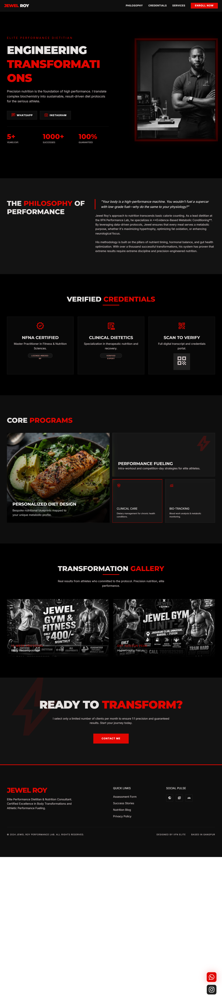

<div align="center">


# IIFN — Indian Institute of Fitness & Nutrition

### Science-Based Online Fitness Certification, Jewel Gym & Performance Dietitian Platform

A modern, high-authority marketing and enrollment platform for a fitness training institute, its affiliated gym chain, and its in-house performance dietitian — built to showcase courses, gym facilities, trainers, alumni success stories, and to capture leads directly into a live Firebase backend, with **instant WhatsApp/Telegram alerts** on every new lead.

[](https://iifn.vercel.app/)
[](https://nextjs.org/)
[](https://react.dev/)
[](https://firebase.google.com/)
[](https://tailwindcss.com/)
[](https://vercel.com/analytics)

**[🌐 Live Site](https://iifn.vercel.app/) · [📂 Repository](https://github.com/Rustam-xx7/IIFN)**

</div>

---

## 📖 About The Project

**IIFN** is a full marketing + lead-generation website built for a real-world client running a **fitness certification academy** (Indian Institute of Fitness & Nutrition), an affiliated **gym chain (Jewel Gym)**, and an **in-house performance dietitian practice**. The client base spans course aspirants (personal trainers, nutritionists), gym members, one-on-one diet clients, and corporate/institutional affiliates.

The site was designed to:

- Establish **authority and trust** — global media mentions, ISO/Govt/NSDC affiliations, an alumni network placed at major fitness brands, and a **government-portal certificate verification** link.
- Present a **course catalog & curriculum** (CPT, Nutrition & Dietetics, Combo Program) with pricing, syllabus breakdowns, and a live enrollment flow.
- Drive **enquiries and enrollments** through multiple conversion-focused forms across the site.
- Showcase the **gym facility** (Jewel Gym) — multiple physical units, amenities, membership plans, and trainer profiles.
- Promote a **dedicated performance dietitian landing page** with credentials, service offerings, and a real transformation gallery.
- Collect and **moderate student reviews**, and manage all incoming leads through a **custom admin dashboard**.
- **Instantly notify the business owner** the moment a new enquiry or enrollment lands — no dashboard-checking required — via an automated **Firebase Cloud Function → WhatsApp/Telegram** pipeline.

Every enquiry, enrollment, signup, and review on the live site is written directly to **Cloud Firestore**, giving the academy/gym owner a real, working backend — not just a static brochure site — and every new document creation fires an automated notification straight to the owner's phone.

---

## ✨ What's New in This Update

This is a major revision of the original build. Key additions since the last release:

- 🥗 **New Dietitian Showcase Page** (`/dietition`) — a full personal-brand landing page for the in-house performance dietitian (Dt. Jewel Roy): hero with booking CTA, philosophy/bio section, verified-credentials cards, a bento-style "Core Programs" grid, and a real **before/after transformation gallery**.
- 🔐 **Real Firebase Authentication** — signup/login now runs through the actual **Firebase Auth** SDK (`createUserWithEmailAndPassword` / `signInWithEmailAndPassword`) instead of a Firestore-only lookup, with user profile data synced to Firestore by UID. Old Firestore-based auth helpers are kept for backward compatibility.
- ⚡ **Automated WhatsApp/Telegram Lead Alerts (Firebase Cloud Functions)** — new `functions/` codebase using **Cloud Functions for Firebase (2nd Gen)**. `onDocumentCreated` triggers fire automatically the instant a new `enquiry` or `enrollment` document is written to Firestore, formatting the lead details and pushing them straight to the owner's WhatsApp in real time — zero manual checking of the dashboard required.
- 🎓 **Government Certificate Verification Link** — a new "Verify Certificate" navbar link and homepage trust section pointing to the official **NCBSD Skill India** student result portal, reinforcing that every certificate is nationally registered.
- 📄 **Downloadable Brochure & Legal Docs** — "Download Brochure" CTA (`IIFN_Brochure.pdf`) on the homepage hero, plus a consolidated **legal policy PDF** (`iifn_legal_policies.pdf`) linked from the footer for Privacy Policy, Terms of Service, and Refund Policy.
- 📊 **Vercel Analytics** integrated site-wide (`@vercel/analytics`) for real visitor/traffic insight.
- 🖼️ **Expanded certified-professionals gallery** — the candidate showcase carousel now runs 20+ real certified graduates/gym members instead of a handful of placeholders.
- 🎨 **Refined "Performance Lab" dark theme** — updated red-accent glassmorphism styling, glow-hover states, and bento-grid layouts extended across the new Dietitian page and refreshed sections on Home/Gym.
- 🧭 **Updated navigation** — `Dietitian` added to the primary nav across desktop and mobile menus, alongside the external certificate-verification link.

---

## 🤖 Firebase Cloud Functions — Automated Lead Notifications

One of the most valuable additions for the client: **the moment a new lead is created in Firestore, it's pushed to their phone automatically** — no polling, no manual dashboard checks, no missed leads.

**How it works:**

1. A visitor submits an enquiry or enrollment form anywhere on the site.
2. The form writes a new document to the `enquiry` or `enrollment` collection in **Cloud Firestore**.
3. A **Firebase Cloud Function (2nd Gen)**, subscribed via `onDocumentCreated`, triggers automatically on that write — no polling, no client-side code involved.
4. The function formats the lead's details (name, phone, email, city, course, occupation, investment, experience, etc.) into a clean message.
5. The message is dispatched instantly to the business owner's **WhatsApp**, so they can follow up with a hot lead within seconds of it being submitted — the same event-driven pattern can be pointed at a **Telegram Bot API** endpoint for teams who prefer Telegram alerts instead of (or alongside) WhatsApp.

```
Firestore write (new doc)
        │
        ▼
onDocumentCreated trigger  (functions/index.js)
        │
        ▼
Format lead → message
        │
        ▼
Push notification → WhatsApp / Telegram
```

**Functions included:**

| Function | Trigger | Purpose |
|---|---|---|
| `notifyOnEnquiry` | New doc in `enquiry/{docId}` | Sends a formatted WhatsApp alert with name, phone, email, city & course |
| `notifyOnEnrollment` | New doc in `enrollment/{docId}` | Sends a formatted WhatsApp alert with name, phone, email, course, occupation, investment & experience |

This turns the site from a passive "brochure with a form" into an **active sales pipeline** — every enquiry reaches the owner in near real time, which is directly reflected in the sales impact below.

---

## 📈 Business Impact

This wasn't just a design refresh — it was a conversion and trust upgrade. Since launching this rebuilt platform, the client has reported approximately **40% more sales enquiries and audience attention**, driven by the combination of the high-authority visual design, the always-on lead capture forms, and — critically — the instant WhatsApp lead alerts that let the team respond to prospects while their interest is still hot.

---

## ✨ Key Features

### Public-Facing Website
- 🏠 **High-authority homepage** — hero with brochure download, "as featured in" global press strip, affiliations/accreditation strip, "How IIFN Works" 6-step process, course previews, alumni logos, stats bar, testimonials, certificate-verification trust block, and a certified-professionals gallery.
- 📚 **Course catalog** (`/courses`) — course cards (CPT, Nutrition & Dietetics, Combo), pricing, "What You Receive" benefits grid, live enrollment form with dynamic pricing per program, and a "Talk to an Advisor" flow.
- 🏋️ **Jewel Gym page** (`/gym`) — multi-unit showcase (Unit 1 – Gangpur, Unit 2 – Barsul) with plan pricing, facilities, trainer profiles, gallery, and a unit-specific membership enquiry form.
- 🥗 **Dietitian page** (`/dietition`) — dedicated personal-brand page for the performance dietitian: credentials, service bento-grid, real transformation gallery, and direct WhatsApp/Instagram booking CTAs.
- 🏢 **About page** (`/about`) — institutional stats, government/ISO affiliations with registration numbers, and faculty profiles.
- ✉️ **Contact page** (`/contact`) — general enquiry form with course & experience fields.
- ⭐ **Review system** — visitors can submit a rating + comment from the footer; only **admin-approved** reviews are shown publicly.
- 🔗 **Certificate verification** — direct link to the official government (NCBSD Skill India) portal for public certificate authenticity checks.
- 🎬 **Animated loading screen** with a canvas/WebGL-driven intro sequence on first load.
- 🌓 **Dark, premium "performance lab" aesthetic** using a custom Material Design 3–inspired color system with red-accent glow states.

### Authentication & Admin
- 🔐 **Sign up / Login** (`/signup`, `/login`) — real **Firebase Authentication** (email/password) with user profile data (name, phone, course, role) synced to Firestore by UID, and role-based access (`user` / `admin`).
- 🛡️ **Admin Dashboard** (`/admin`) — protected route with a sidebar-driven panel to view:
  - 📩 Enquiries
  - 📝 Enrollments
  - 👥 Registered Users
  - ⭐ Reviews (with **approve / delete** moderation controls)
  - 🔎 Search across records

### Automation & Integrations
- ⚡ **Firebase Cloud Functions** — automatic WhatsApp/Telegram lead notifications the instant a new enquiry or enrollment document is created (see dedicated section above).
- 📊 **Vercel Analytics** — real-time visitor and traffic tracking.
- 📄 **Downloadable brochure & legal PDFs** served directly from `/public`.

### Engineering Highlights
- Built entirely on the **Next.js App Router** with client components for interactive sections.
- Centralized **Firestore service layer** (`src/service/firestore.service.js`) abstracting all reads/writes (enquiries, enrollments, users, reviews).
- Dedicated **Firebase Auth service layer** (`src/service/firebaseAuth.service.js`) handling signup/login/logout against real Firebase Authentication.
- Independent **Cloud Functions codebase** (`functions/`) deployed separately from the Next.js app, event-driven off Firestore writes.
- Fully **responsive** layouts for mobile, tablet, and desktop.
- **Design source-of-truth** kept in the repo (`/Stitch`) — each page has a static HTML prototype + rendered screenshot used as the design reference before implementation, including the new Dietitian page and an "Elite Performance Framework" design exploration.

---

## 🖼️ Screenshots

> Screenshots below are the implemented design references stored in this repository under [`/Stitch/websitePages`](./Stitch/websitePages), matching the live production build at [iifn.vercel.app](https://iifn.vercel.app/).

<table>
<tr>
<td width="50%">

**Home Page**

</td>
<td width="50%">

**Our Courses**

</td>
</tr>
<tr>
<td width="50%">

**CPT Certification Program**

</td>
<td width="50%">

**Jewel Gym**

</td>
</tr>
<tr>
<td width="50%">

**Performance Dietitian**

</td>
<td width="50%">

**About Us**

</td>
</tr>
<tr>
<td width="50%">

**Contact Us**

</td>
<td width="50%">

**Admin Dashboard**

</td>
</tr>
</table>

---

## 🛠️ Tech Stack

| Layer | Technology |
|---|---|
| **Framework** | [Next.js 16](https://nextjs.org/) (App Router) |
| **UI Library** | [React 19](https://react.dev/) |
| **Styling** | [Tailwind CSS v4](https://tailwindcss.com/) with a custom Material Design 3–style token theme (`globals.css`) |
| **Fonts** | `Montserrat` (display) & `Inter` (body) via `next/font/google`; Google **Material Symbols** for icons |
| **Backend / Database** | [Firebase](https://firebase.google.com/) — **Cloud Firestore** for enquiries, enrollments, users, and reviews |
| **Authentication** | **Firebase Authentication** (email/password), with profile data synced to Firestore by UID |
| **Automation** | **Firebase Cloud Functions (2nd Gen)** — event-driven WhatsApp/Telegram notifications on new Firestore documents |
| **Analytics** | [Vercel Analytics](https://vercel.com/analytics) |
| **Linting** | ESLint 9 with `eslint-config-next` (app) · ESLint 8 with `eslint-config-google` (functions) |
| **Deployment** | [Vercel](https://vercel.com/) (web app) + [Firebase](https://firebase.google.com/) (Functions, Auth, Firestore) |
| **Design Prototyping** | Static HTML/CSS mockups per page, kept in-repo under `/Stitch` |

### Firestore Collections

| Collection | Purpose | Written From | Triggers Notification? |
|---|---|---|---|
| `enquiry` | General enquiries (course, contact, gym membership, advisor requests) | Home, Courses, Gym, Contact pages | ✅ WhatsApp/Telegram via `notifyOnEnquiry` |
| `enrollment` | Direct course enrollments | Courses page | ✅ WhatsApp/Telegram via `notifyOnEnrollment` |
| `users` | Registered accounts (`role: user \| admin`), keyed by Firebase Auth UID | Signup page, read at Login | — |
| `reviews` | Student testimonials (`approved: boolean` moderation flag) | Footer review form, moderated in Admin Dashboard | — |

---

## 📁 Project Structure

```
IIFN/
├── public/                          # Static assets served at the web root
│   ├── affilations/                 # Accreditation/affiliation logos (ISO, NSDC, MSME, etc.)
│   ├── alumni/                      # Alumni placement brand logos (Gold's Gym, Cult.fit, etc.)
│   ├── candidates/                  # Certified professional / testimonial photos (20+ graduates)
│   ├── press/                       # "As Featured In" media logos (ANI, Zee5, The Telegraph...)
│   ├── gymlogo.png                  # IIFN / Jewel Gym brand logo
│   ├── jewel.jpg                    # Dietitian / chief trainer portrait
│   ├── dietResult1.jpg              # Diet transformation gallery — result 1
│   ├── dietResult2.jpg              # Diet transformation gallery — result 2
│   ├── poster1.png / poster2.png    # Promotional gym posters
│   ├── IIFN_Brochure.pdf            # Downloadable institute brochure
│   ├── iifn_legal_policies.pdf      # Privacy Policy / Terms / Refund Policy (single PDF)
│   └── *.svg                        # Default Next.js icons
│
├── src/
│   ├── app/                         # Next.js App Router — one folder per route
│   │   ├── page.js                  # "/"          — Homepage
│   │   ├── about/page.js            # "/about"     — About, affiliations, faculty
│   │   ├── courses/page.js          # "/courses"   — Course catalog + enrollment form
│   │   ├── gym/page.js              # "/gym"       — Jewel Gym units + membership enquiry
│   │   ├── dietition/page.js        # "/dietition" — Performance Dietitian showcase (NEW)
│   │   ├── contact/page.js          # "/contact"   — Contact & enquiry form
│   │   ├── login/page.js            # "/login"     — Firebase Auth login
│   │   ├── signup/page.js           # "/signup"    — Firebase Auth signup
│   │   ├── admin/page.js            # "/admin"     — Protected admin dashboard
│   │   ├── layout.js                # Root layout, fonts, metadata
│   │   ├── globals.css              # Tailwind v4 theme tokens & global styles
│   │   └── favicon.ico
│   │
│   ├── components/
│   │   ├── Navbar.jsx                # Responsive nav (incl. Dietitian & Verify Certificate links)
│   │   ├── Footer.jsx                # Footer, legal links, brand credit + review submission form
│   │   ├── LoadingScreen.jsx         # Canvas/WebGL animated intro loader
│   │   └── AdminSidebar.jsx          # Sidebar navigation for the admin dashboard
│   │
│   ├── lib/
│   │   └── firebase.js               # Firebase app + Firestore + Auth + Analytics initialization
│   │
│   └── service/
│       ├── firestore.service.js      # Firestore CRUD: enquiries, enrollments, users, reviews
│       └── firebaseAuth.service.js   # Firebase Auth: signup / login / logout (NEW)
│
├── functions/                        # Firebase Cloud Functions codebase (NEW — separate deploy target)
│   ├── index.js                      # onDocumentCreated triggers → WhatsApp/Telegram notifications
│   ├── package.json                  # Cloud Functions dependencies (firebase-admin, firebase-functions, axios)
│   └── package-lock.json
│
├── Stitch/                           # Design source-of-truth (prototypes & screenshots)
│   ├── websitePages/
│   │   ├── home_iifn_fitness_academy_high_authority/
│   │   ├── our_courses_iifn_academy/
│   │   ├── cpt_course_iifn_fitness_academy/
│   │   ├── jewel_gym_performance_fitness/
│   │   ├── dietitionPage/                     # (NEW) Dietitian page design reference
│   │   ├── elite_performance_framework/       # (NEW) design exploration
│   │   ├── about_us_iifn_fitness_academy/
│   │   ├── contact_us_iifn_fitness_academy/
│   │   ├── admin_dashboard_iifn_academy/
│   │   │   └── (each folder: code.html + screen.png)
│   │   └── contents/                 # Poster & logo source images
│   └── loadingAnimation/             # Loader prototypes (SVG / shader experiments)
│
├── firebase.json                     # Firebase project config (Functions codebase, lint predeploy hook)
├── eslint.config.mjs
├── jsconfig.json
├── next.config.mjs
├── postcss.config.mjs
├── package.json
└── package-lock.json
```
---

## 🚀 Getting Started

### Prerequisites
- **Node.js** 18.18+ (recommended: latest LTS; Cloud Functions run on Node 24)
- A **Firebase project** with **Cloud Firestore**, **Authentication (Email/Password)**, and **Cloud Functions (2nd Gen, Blaze plan)** enabled
- A **CallMeBot** (or equivalent WhatsApp/Telegram Bot API) API key for outbound notifications

### 1. Clone the repository
```bash
git clone https://github.com/Rustam-xx7/IIFN.git
cd IIFN
```

### 2. Install dependencies
```bash
npm install
```

### 3. Configure environment variables
Create a `.env.local` file in the project root with your Firebase project credentials:

```env
NEXT_PUBLIC_FIREBASE_API_KEY=your_api_key
NEXT_PUBLIC_FIREBASE_AUTH_DOMAIN=your_project.firebaseapp.com
NEXT_PUBLIC_FIREBASE_PROJECT_ID=your_project_id
NEXT_PUBLIC_FIREBASE_STORAGE_BUCKET=your_project.appspot.com
NEXT_PUBLIC_FIREBASE_MESSAGING_SENDER_ID=your_sender_id
NEXT_PUBLIC_FIREBASE_APP_ID=your_app_id
NEXT_PUBLIC_FIREBASE_MEASUREMENT_ID=your_measurement_id
```

Enable **Email/Password** sign-in under Firebase Authentication for the login/signup flow to work.

### 4. Run the development server
```bash
npm run dev
```

Open [http://localhost:3000](http://localhost:3000) in your browser to see the site.

### 5. (Optional) Set up the Cloud Functions notification pipeline
```bash
cd functions
npm install
```
Update the WhatsApp phone number and API key in `functions/index.js` (or swap in a Telegram Bot API call), then deploy:
```bash
firebase deploy --only functions
```

### Available Scripts
| Command | Description |
|---|---|
| `npm run dev` | Start the local development server |
| `npm run build` | Create a production build |
| `npm run start` | Serve the production build |
| `npm run lint` | Run ESLint checks |

**Functions scripts** (run inside `/functions`):
| Command | Description |
|---|---|
| `npm run serve` | Start the Firebase emulator for Functions only |
| `npm run shell` | Interactive Firebase Functions shell |
| `npm run deploy` | Deploy Cloud Functions to Firebase |
| `npm run logs` | Tail deployed Function logs |

---

## 🗺️ Route Map

| Route | Page | Description |
|---|---|---|
| `/` | Home | Hero, press mentions, affiliations, process, courses preview, stats, testimonials, certificate verification, certified professionals gallery |
| `/courses` | Courses | Full catalog with pricing, benefits grid, and live enrollment form |
| `/gym` | Jewel Gym | Gym units, plans, facilities, trainers, gallery, membership enquiry |
| `/dietition` | Dietitian | Performance dietitian personal brand page, credentials, transformation gallery |
| `/about` | About Us | Stats, affiliations, faculty |
| `/contact` | Contact | General enquiry form |
| `/login` | Login | Firebase Auth login |
| `/signup` | Sign Up | Firebase Auth registration |
| `/admin` | Admin Dashboard | Protected — enquiries, enrollments, users, review moderation |

---

## 🚢 Deployment

This project deploys across two platforms:

- **Web App:** [Vercel](https://vercel.com/), connected to the GitHub repository for automatic deployments on every push to `main`. **Live URL:** [https://iifn.vercel.app](https://iifn.vercel.app/)
- **Cloud Functions:** [Firebase](https://firebase.google.com/), deployed independently via the Firebase CLI (`firebase deploy --only functions`) from the `functions/` codebase.

To deploy your own instance, add the Firebase environment variables from the [`.env.local`](#3-configure-environment-variables) step to your Vercel project settings, then import the repository at [vercel.com/new](https://vercel.com/new). For the notification pipeline, configure your WhatsApp/Telegram Bot API credentials in `functions/index.js` and deploy via the Firebase CLI.

---

## 👤 Credits

- **Client:** Indian Institute of Fitness & Nutrition (IIFN), Jewel Gym & Performance Dietitian Dt. Jewel Roy
- **Client Instagram:** [@iifn.in](https://www.instagram.com/iifn.in/)
- **Business Impact:** Since this platform went live, the client has reported roughly **40% more sales enquiries and audience attention**, driven by the upgraded design, live lead-capture forms, and instant WhatsApp lead alerts that let the team follow up while a prospect's interest is still fresh.
- **Development:** Freelance build — full-stack Next.js + Firebase (Auth, Firestore, Cloud Functions) implementation
- **Design Prototyping:** Static mockups maintained under [`/Stitch`](./Stitch)

---

## 🧑‍💻 About the Developer

This project was designed and developed as a freelance engagement by **Rustam (Dipayan Chakraborty)**, a Full Stack Developer (MERN) building under the handle **Kaizen Devs / kaizen_rus**.

- **GitHub:** [@Rustam-xx7](https://github.com/Rustam-xx7)
- **LinkedIn:** [Dipayan Chakraborty](https://www.linkedin.com/in/dipayan-chakraborty-961232348/)
- **Instagram:** [@kaizen_rus](https://www.instagram.com/kaizen_rus)
- **WhatsApp:** [+91 96416 82925](https://wa.me/919641682925)

Full stack developer working across **React / Next.js, Node.js, MongoDB & Firebase**, currently deepening skills in **Redis, Docker, and Supabase**, with a focus on building high-authority marketing sites that don't just look premium but are wired end-to-end for lead capture, automation, and real business results — like the automated WhatsApp lead-alert pipeline built into this project.

Open to freelance projects and collaboration — feel free to reach out via GitHub, LinkedIn, Instagram, or WhatsApp above.

---

<div align="center">

**[🌐 Visit the Live Site](https://iifn.vercel.app/)**

</div>