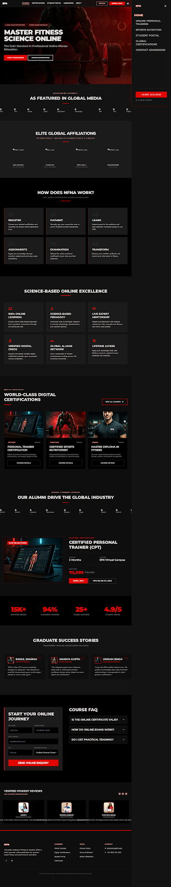
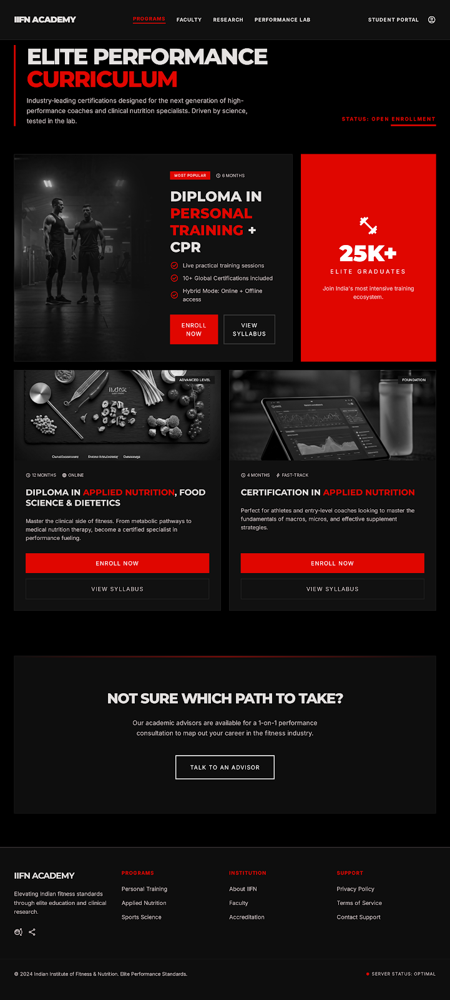
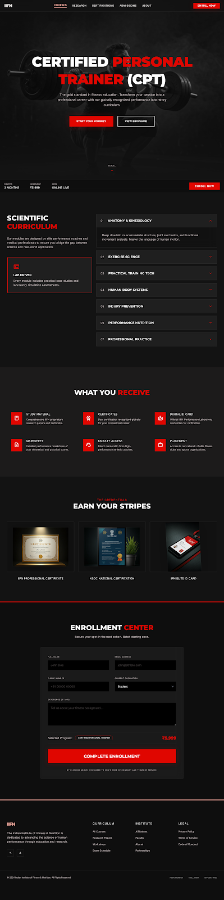
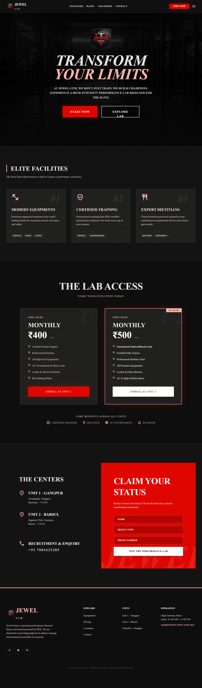
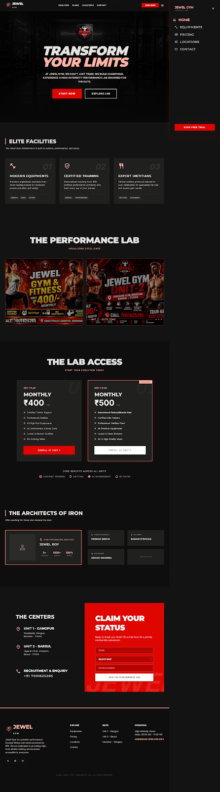
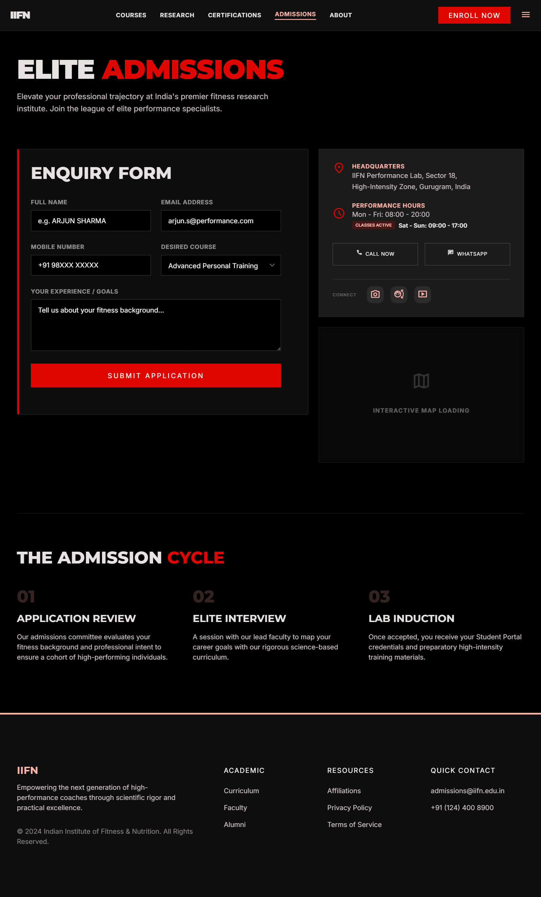
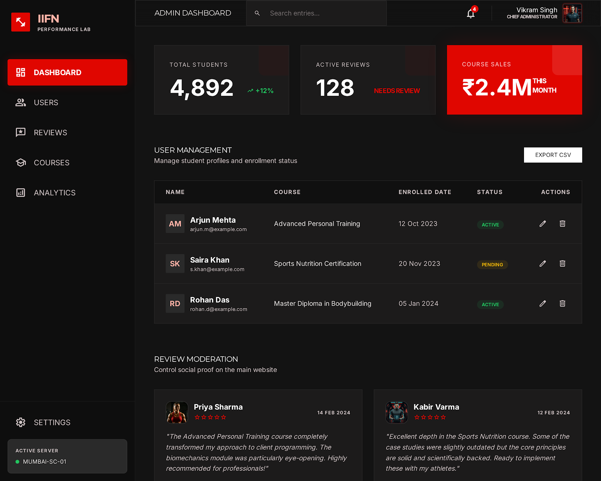

<div align="center">


# IIFN — Indian Institute of Fitness & Nutrition

### Science-Based Online Fitness Certification & Jewel Gym Platform

A modern, high-authority marketing and enrollment platform for a fitness training institute and its affiliated gym chain — built to showcase courses, gym facilities, trainers, alumni success stories, and to capture leads directly into a live database.

[](https://iifn.vercel.app/)
[](https://nextjs.org/)
[](https://react.dev/)
[](https://firebase.google.com/)
[](https://tailwindcss.com/)

**[🌐 Live Site](https://iifn.vercel.app/) · [📂 Repository](https://github.com/Rustam-xx7/IIFN)**

</div>

---

## 📖 About The Project

**IIFN** is a full marketing + lead-generation website built for a real-world client running a **fitness certification academy** (Indian Institute of Fitness & Nutrition) alongside a **gym chain (Jewel Gym)**. The client base spans course aspirants (personal trainers, nutritionists), gym members, and corporate/institutional affiliates.

The site was designed to:

- Establish **authority and trust** — media mentions, ISO/Govt affiliations, alumni placed at major fitness brands.
- Present **course catalog & curriculum** (CPT, Sports Nutrition, Master Diploma) with detailed syllabus breakdowns.
- Drive **enquiries and enrollments** through multiple conversion-focused forms across the site.
- Showcase the **gym facility** (Jewel Gym) — multiple units, amenities, membership plans.
- Collect and **moderate student reviews**, and manage all incoming leads through a **custom admin dashboard**.

Every enquiry, enrollment, signup, and review on the live site is written directly to **Cloud Firestore**, giving the gym/academy owner a real, working backend — not just a static brochure site.

---

## ✨ Key Features

### Public-Facing Website
- 🏠 **High-authority homepage** — hero, "as featured in" press strip, affiliations/accreditation strip, "How IIFN Works" 6-step process, alumni logos, testimonials, and success gallery.
- 📚 **Course catalog** (`/courses`) — course cards, expandable syllabus accordions, "Talk to an Advisor" modal capturing counselling requests.
- 🎓 **Dedicated CPT program page** (`/cpt`) — deep-dive syllabus, accordion modules, and a direct enrollment form.
- 🏋️ **Jewel Gym page** (`/gym`) — multi-unit gym showcase (e.g. *Unit 1 - Gangpur*) with a membership enquiry form tied to a specific unit.
- 🏢 **About page** (`/about`) — institutional stats, government/ISO affiliations with registration numbers, and faculty profiles.
- ✉️ **Contact page** (`/contact`) — general enquiry form with course & experience fields.
- ⭐ **Review system** — visitors can submit a rating + comment from the footer; only **admin-approved** reviews are shown publicly.
- 🎬 **Animated loading screen** with a canvas/WebGL-driven intro sequence on first load.
- 🌓 **Dark, premium "performance lab" aesthetic** using a custom Material Design 3–inspired color system.

### Authentication & Admin
- 🔐 **Sign up / Login** (`/signup`, `/login`) — Firestore-backed user accounts with role-based access (`user` / `admin`).
- 🛡️ **Admin Dashboard** (`/admin`) — protected route (session-checked via `localStorage`) with a sidebar-driven panel to view:
  - 📩 Enquiries
  - 📝 Enrollments
  - 👥 Registered Users
  - ⭐ Reviews (with **approve / delete** moderation controls)
  - 🔎 Search across records

### Engineering Highlights
- Built entirely on the **Next.js App Router** with client components for interactive sections.
- Centralized **Firestore service layer** (`src/service/firestore.service.js`) abstracting all reads/writes (enquiries, enrollments, users, reviews).
- Fully **responsive** layouts for mobile, tablet, and desktop.
- **Design source-of-truth** kept in the repo (`/Stitch`) — each page has a static HTML prototype + rendered screenshot used as the design reference before implementation.

---

## 🖼️ Screenshots

> Screenshots below are the implemented design references stored in this repository under [`/Stitch/websitePages`](./Stitch/websitePages), matching the live production build at [iifn.vercel.app](https://iifn.vercel.app/).

<table>
<tr>
<td width="50%">

**Home Page**

</td>
<td width="50%">

**Our Courses**

</td>
</tr>
<tr>
<td width="50%">

**CPT Certification Program**

</td>
<td width="50%">

**Jewel Gym**

</td>
</tr>
<tr>
<td width="50%">

**Gym Gallery & Trainers**

</td>
<td width="50%">

**About Us**

</td>
</tr>
<tr>
<td width="50%">

**Contact Us**

</td>
<td width="50%">

**Admin Dashboard**

</td>
</tr>
</table>

---

## 🛠️ Tech Stack

| Layer | Technology |
|---|---|
| **Framework** | [Next.js 16](https://nextjs.org/) (App Router) |
| **UI Library** | [React 19](https://react.dev/) |
| **Styling** | [Tailwind CSS v4](https://tailwindcss.com/) with a custom Material Design 3–style token theme (`globals.css`) |
| **Fonts** | `Montserrat` (display) & `Inter` (body) via `next/font/google`; Google **Material Symbols** for icons |
| **Backend / Database** | [Firebase](https://firebase.google.com/) — **Cloud Firestore** for enquiries, enrollments, users, and reviews |
| **Auth Pattern** | Custom Firestore-based auth (email/password lookup) with session persisted in `localStorage` and role-based route protection |
| **Linting** | ESLint 9 with `eslint-config-next` |
| **Deployment** | [Vercel](https://vercel.com/) |
| **Design Prototyping** | Static HTML/CSS mockups per page, kept in-repo under `/Stitch` |

### Firestore Collections

| Collection | Purpose | Written From |
|---|---|---|
| `enquary` | General enquiries (course, contact, gym membership, advisor requests) | Home, Courses, Gym, Contact pages |
| `enrollment` | Direct course enrollments | CPT program page |
| `users` | Registered accounts (`role: user \| admin`) | Signup page, read at Login |
| `reviews` | Student testimonials (`approved: boolean` moderation flag) | Footer review form, moderated in Admin Dashboard |

---

## 📁 Project Structure

```
IIFN/
├── public/                          # Static assets served at the web root
│   ├── affilations/                 # Accreditation/affiliation logos (ISO, NSDC, MSME, etc.)
│   ├── alumni/                      # Alumni placement brand logos (Gold's Gym, Cult.fit, etc.)
│   ├── candidates/                  # Certified professional / testimonial photos
│   ├── press/                       # "As Featured In" media logos (ANI, Zee5, The Telegraph...)
│   ├── gymlogo.png                  # IIFN brand logo
│   ├── poster1.png / poster2.png    # Promotional posters
│   └── *.svg                        # Default Next.js icons
│
├── src/
│   ├── app/                         # Next.js App Router — one folder per route
│   │   ├── page.js                  # "/"        — Homepage
│   │   ├── about/page.js            # "/about"   — About, affiliations, faculty
│   │   ├── courses/page.js          # "/courses" — Course catalog + advisor modal
│   │   ├── cpt/page.js              # "/cpt"     — CPT program detail + enrollment
│   │   ├── gym/page.js              # "/gym"     — Jewel Gym units + membership enquiry
│   │   ├── contact/page.js          # "/contact" — Contact & enquiry form
│   │   ├── login/page.js            # "/login"   — Firestore-backed login
│   │   ├── signup/page.js           # "/signup"  — Firestore-backed signup
│   │   ├── admin/page.js            # "/admin"   — Protected admin dashboard
│   │   ├── layout.js                # Root layout, fonts, metadata
│   │   ├── globals.css              # Tailwind v4 theme tokens & global styles
│   │   └── favicon.ico
│   │
│   ├── components/
│   │   ├── Navbar.jsx                # Responsive nav, active-link state, role-aware links
│   │   ├── Footer.jsx                # Footer + review submission form
│   │   ├── LoadingScreen.jsx         # Canvas/WebGL animated intro loader
│   │   └── AdminSidebar.jsx          # Sidebar navigation for the admin dashboard
│   │
│   ├── lib/
│   │   └── firebase.js               # Firebase app + Firestore + Analytics initialization
│   │
│   └── service/
│       └── firestore.service.js      # All Firestore CRUD: enquiries, enrollments, auth, reviews
│
├── Stitch/                           # Design source-of-truth (prototypes & screenshots)
│   ├── websitePages/
│   │   ├── home_iifn_fitness_academy_high_authority/
│   │   ├── our_courses_iifn_academy/
│   │   ├── cpt_course_iifn_fitness_academy/
│   │   ├── jewel_gym_performance_fitness/
│   │   ├── jewel_gym_gallery_trainers/
│   │   ├── about_us_iifn_fitness_academy/
│   │   ├── contact_us_iifn_fitness_academy/
│   │   ├── admin_dashboard_iifn_academy/
│   │   │   └── (each folder: code.html + screen.png)
│   │   └── contents/                 # Poster & logo source images
│   └── loadingAnimation/             # Loader prototypes (SVG / shader experiments)
│
├── eslint.config.mjs
├── jsconfig.json
├── next.config.mjs
├── postcss.config.mjs
├── package.json
└── package-lock.json
```
---

## 🚀 Getting Started

### Prerequisites
- **Node.js** 18.18+ (recommended: latest LTS)
- A **Firebase project** with Cloud Firestore enabled

### 1. Clone the repository
```bash
git clone https://github.com/Rustam-xx7/IIFN.git
cd IIFN
```

### 2. Install dependencies
```bash
npm install
```

### 3. Configure environment variables
Create a `.env.local` file in the project root with your Firebase project credentials:

```env
NEXT_PUBLIC_FIREBASE_API_KEY=your_api_key
NEXT_PUBLIC_FIREBASE_AUTH_DOMAIN=your_project.firebaseapp.com
NEXT_PUBLIC_FIREBASE_PROJECT_ID=your_project_id
NEXT_PUBLIC_FIREBASE_STORAGE_BUCKET=your_project.appspot.com
NEXT_PUBLIC_FIREBASE_MESSAGING_SENDER_ID=your_sender_id
NEXT_PUBLIC_FIREBASE_APP_ID=your_app_id
NEXT_PUBLIC_FIREBASE_MEASUREMENT_ID=your_measurement_id
```

### 4. Run the development server
```bash
npm run dev
```

Open [http://localhost:3000](http://localhost:3000) in your browser to see the site.

### Available Scripts
| Command | Description |
|---|---|
| `npm run dev` | Start the local development server |
| `npm run build` | Create a production build |
| `npm run start` | Serve the production build |
| `npm run lint` | Run ESLint checks |

---

## 🗺️ Route Map

| Route | Page | Description |
|---|---|---|
| `/` | Home | Hero, press mentions, affiliations, process, courses preview, testimonials |
| `/courses` | Courses | Full catalog with syllabus accordions + advisor request modal |
| `/cpt` | CPT Program | Detailed course page with enrollment form |
| `/gym` | Jewel Gym | Gym units, facilities, membership enquiry |
| `/about` | About Us | Stats, affiliations, faculty |
| `/contact` | Contact | General enquiry form |
| `/login` | Login | Firestore-authenticated login |
| `/signup` | Sign Up | New account registration |
| `/admin` | Admin Dashboard | Protected — enquiries, enrollments, users, review moderation |

---

## 🚢 Deployment

This project is deployed on **[Vercel](https://vercel.com/)**, connected to the GitHub repository for automatic deployments on every push to `main`.

**Live URL:** [https://iifn.vercel.app](https://iifn.vercel.app/)

To deploy your own instance, add the Firebase environment variables from the [`.env.local`](#3-configure-environment-variables) step to your Vercel project settings, then import the repository at [vercel.com/new](https://vercel.com/new).

---

## 👤 Credits

- **Client:** Indian Institute of Fitness & Nutrition (IIFN) & Jewel Gym
- **Development:** Freelance build — full-stack Next.js + Firebase implementation
- **Design Prototyping:** Static mockups maintained under [`/Stitch`](./Stitch)

---

<div align="center">

**[🌐 Visit the Live Site](https://iifn.vercel.app/)**

</div>